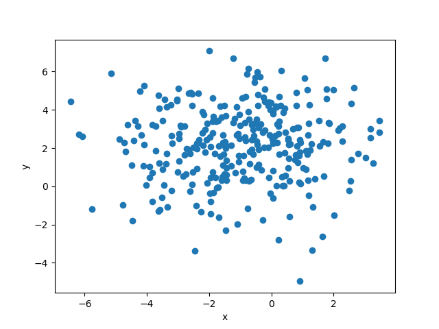
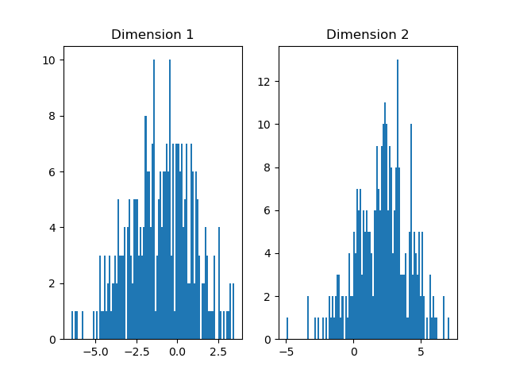
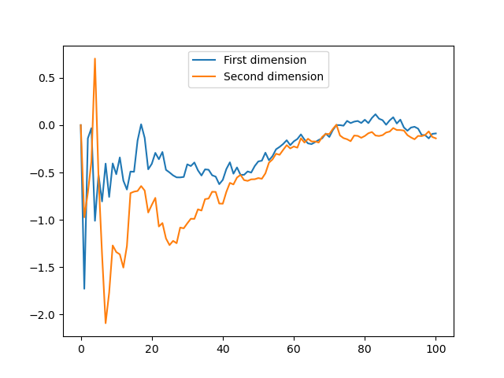
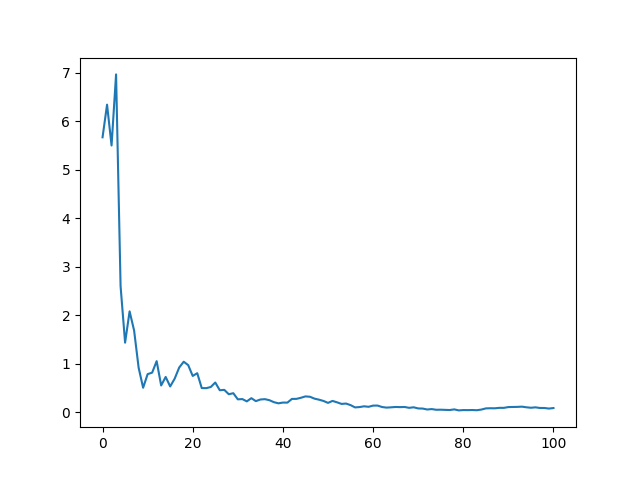

# Sequential Estimation
Online learning is very important in machine learning as it allows for the inclusion of new data samples without having to recalculate model parameters for the rest of the data. The aim of this exercise is to explore this concept.

We will now look into online estimation of a mean vector. The objective is to apply the following formula for estimating a mean *(see Bishop Section 3.2.8)*:

$$
\mu_{ML}^{N} = \mu_{ML}^{N-1} + \frac{1}{N}(x_n - \mu_{ML}^{N-1})
$$

## Requirements

You will need the following requirements to finish this requirement.

- `numpy`: https://numpy.org/
- `matplotlib`: https://matplotlib.org/

You can run `pip install -r requirements.txt` to install all the requirements.

### Section 1
Let's first create a data generator. Create a function `gen_data(n, k, mean, std)` which returns a $n\times k$ array, $X$. This $X$ contains a sequence of $n$ vectors of dimension $k$. Each vector $x_i$ in $X$ should be $x_i \sim N_k(\mu, \sigma^2I_k)$ where:

* $N_k()$ is the [k-variate normal distribution](https://en.wikipedia.org/wiki/Multivariate_normal_distribution)
* $\mu$ (or `mean`) is the mean vector of dimension $k$
* $\sigma$ (or `std`) is the standard deviation.
* $I_k$ is the [identity matrix](https://en.wikipedia.org/wiki/Identity_matrix)

You should use [`np.random.multivariate_normal`](https://docs.scipy.org/doc/numpy-1.14.0/reference/generated/numpy.random.multivariate_normal.html) for this.

Example inputs and outputs (these examples use `np.random.seed(1234)`):
1. `gen_data(2, 3, np.array([0, 1, -1]), 1.3)`
```
[[ 0.61286571, -0.5482684 ,  0.86251906],
 [-0.40644746,  0.06323465,  0.15331182]]
```
2. `gen_data(5, 1, np.array([0.5]), 0.5)`
```
[[ 0.73571758],
 [-0.09548785],
 [ 1.21635348],
 [ 0.34367405],
 [ 0.13970563]]
```

### Section 2
**Answer this question in a raw text file and submit it as 2_1.txt**

Lets create some data $X$. Create 300 2-dimensional data points sampled from $N_2([-1, 2], \sqrt{4})$

You can visualize your data using `tools.scatter_2d_data` to get a plot similar to the following



You can also use `tools.bar_per_axis` to visualize the distribution of the data per dimension:



Do you expect the batch estimate to be exactly $(-1, 2)$ ? Which two parameters can be used to make this estimate more accurate?

### Section 3
We will now implement the sequential estimate.

We want a function that returns $N$ number of sequential estimates of the mean vector where we feed one vector from $X$ at a time into the function. 
We start by implementing the update equation above.

Create a function `update_sequence_mean(mu, x, n)` which performs the update in the equation above.

Example inputs and outputs:
```
mean = np.mean(X, 0)
new_x = gen_data(1, 2, np.array([0, 0]), 1)
update_sequence_mean(mean, new_x, X.shape[0]+1)
```

Results in an array, similar to `[[-0.85286428  1.95485036]]` (since we're using random numbers, the values you get will probably not be exactly the same).
Gradescope wil use `np.random.seed(1234)` before generating the data to test this function.

### Section 4
Lets plot the estimates on all dimensions as the sequence estimate gets updated. You can use `_plot_sequence_estimate()` as a template. You should:
* Generate 100 2-dimensional points with mean `[0, 0]` and variance `3`.
* Set the initial estimate as $(0, 0)$
* And perform `update_sequence_mean` for each point in the set.
* Collect the estimates as you go

For a different set of points this plot looks like the following:



Turn in your plot as `4_1.png`

### Section 5
Let's now plot the squared error between the estimate and the actual mean after every update.

The squared error between e.g. a ground truth $y$ and a prediction $\hat{y}$ is $(y-\hat{y})^2$.

Of course our data will be 2-dimensional so after calculating the squared error you will have a 2-dimensional error. 
Take the mean of those two values to get the average error across all dimensions and plot those values.

You can use `_plot_square_error` and `_square_error` for this.

For a different distribution this plot looks like the following:



Turn in your plot as `5_1.png`

### What to turn in to Gradescope
*Read this carefully before you submit your solution.*

You should edit `template.py` to include your own code.

This is an individual project, you can of course help each other out but your code should be your own.

You can use built-in python modules as you wish, however you are not allowed to install and import packages other than are already imported. 

Files to turn in:

- `template.py`: This is your code
- `2_1.txt`
- `4_1.png`
- `5_1.png`

Make sure the file names are exact.
Submission that do not pass the first two tests in Gradescope will not be graded.


## Independent Section (optional)
Repeat the above with three dimensions and $\mu =(0,1,-1)$.

What happens if the mean value changes (perhaps slowly) with time? What if  $\mu =(0,1,-1)$ moves to  $\mu=(1,-1,0)$ in 500 time ticks? 
How would we track the mean? Some sort of forgetting could be added to the update equation. How would that be done?

Create this type of data and formulate a method for tracking the mean.

Plot the estimate of all dimensions and the mean squared error over all three dimensions. Turn in these plots as `indep_1.png` and `indep_2.png`.

Write a short summary how your method works.
