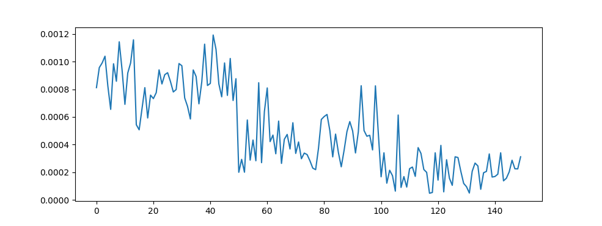

# Linear Models for Regression

In Assignment 2 we tried to *classify* two overlapping distributions we had assigned *classes*, 
if you continued with the Independent section of [Assignment 2](02_classification/README.md#independent-section-optional) 
you have also tried to *classify* flowers from the Iris dataset. 
Classification tasks assume that we have a set of *features* and a set of *class labels* that we would like our models 
to learn to predict.

Regression tasks don't assume categorical labels. 
In regression tasks we again have some set of *features* but the value we want to predict isn't a label anymore 
but some value from a continuous domain. 
Therefor the output domain of the model is continuous.

You can for example imagine the quadratic equation

$$
    y = ax^2 + bx + c
$$

An example of a regression task might be to predict what $a, b, c$ are given a feature set of multiple $(x, y)$ values.

In this assignment we will be using an altered version of the Iris dataset were we have ditched the class label targets 
and replaced them with the last feature column (representing the pedal length of the flower). 
You can load this data with `tools.load_regression_iris`.

# Pytorch

From now on we are going to start relying on Pytorch to handle arrays and matrices as opposed to Numpy.
Although Numpy will continue to be useful, we will take this opportunity to get familiar with the Pytorch library.
Pytorch stores arrays and matrices in [Tensors](https://pytorch.org/tutorials/beginner/introyt/tensors_deeper_tutorial.html).
In future assignments we will be using Tensors to create more complicated models including Neural Networks.

## Requirements

You will need the following requirements to finish this requirement.

- `torch`: https://pytorch.org/
- `matplotlib`: https://matplotlib.org/
- `scikit-learn`: https://scikit-learn.org/stable/index.html

You can run `pip install -r requirements.txt` to install all the requirements.

## Section 1
We are going to use the Gaussian basis functions to predict real valued target variables of our data.

$$
    \phi_k(x) = \frac{1}{(2\pi)^{D/2}} \frac{1}{|\Sigma_k|^{1/2}} e^{-\frac{1}{2} (x-\mu_k)^T \Sigma_k^{-1} (x-\mu_k)}
$$

We control the shift of the basis function using the mean vector $\mu_k$, but we force all covariance matrices to be 
identical and diagonal $\Sigma_k = \sigma^{2}\mathbf{I}$ for all $k$ so $var = \sigma^2$ is the parameter that controls the width 
of all the basis functions (in all directions).

Create a function `mvn_basis(features, mu, var)` that applies the multivariate normal basis function on the set of features. 
You should use the `scipy.stats.multivariate_normal` object to create your multivariate Gaussians.

Example inputs and outputs:

*Load the data*
```
X, t = load_regression_iris()
N, D = X.shape
```

We need to define how many basis functions we are going to use and determine the mean vectors that we are using. 
We also have to define the variance, `var`. We do this arbitrarily.

```
M, var = 10, 10
mu = torch.zeros((M, D))
for i in range(D):
    mmin = torch.min(X[:, i])
    mmax = torch.max(X[:, i])
    mu[:, i] = torch.linspace(mmin, mmax, M)
fi = mvn_basis(X, mu, var)
```

*Output*
```
fi: tensor([[0.0017, 0.0018, 0.0018,  ..., 0.0007, 0.0005, 0.0003],
        [0.0019, 0.0019, 0.0019,  ..., 0.0006, 0.0004, 0.0003],
        [0.0018, 0.0019, 0.0019,  ..., 0.0006, 0.0004, 0.0002],
        ...,
        [0.0006, 0.0009, 0.0012,  ..., 0.0019, 0.0017, 0.0014],
        [0.0006, 0.0008, 0.0011,  ..., 0.0019, 0.0017, 0.0015],
        [0.0007, 0.0010, 0.0013,  ..., 0.0018, 0.0016, 0.0013]])
```

### Section 2

Plot the output of each basis function, using the same parameters as above, as a function of the features. 
You should plot all the outputs onto the same plot. Turn in your plot as `2_1.png`.

A single basis function output is shown below.




### Section 3

Create a function `max_likelihood_linreg(fi, targets, lam)` that estimates the maximum likelihood values for the linear regression model.

Example inputs and outputs:
```
fi = mvn_basis(X, mu, var) # same as before
lamda = 0.001
wml = max_likelihood_linreg(fi, t, lamda)
```
*Output*:
```
wml: tensor([  4.2790,  17.5758,  34.9175,  54.4687,  73.4915,  88.9635,  98.3602,
        100.3262,  94.9887,  83.8179])
```

### Section 4
Finally, create a function `linear_model(features, mu, var, w)` that predicts targets given the weights 
from your `max_likelihood_linreg`, the basis functions, defined by `mu` and `var`, and the `features`.

Example inputs and outputs:

```
wml = max_likelihood_linreg(fi, t, lamda) # as before
prediction = linear_model(X, mu, var, wml)
```
*Output*:
```
prediction: tensor([0.6464, 0.6320, 0.6008, 0.6231, 0.6373, 0.7069, 0.6069, 0.6575, 0.5858,
        0.6497, 0.6784, 0.6573, 0.6240, 0.5327, 0.6286, 0.6571, 0.6356, 0.6464,
        0.7260, 0.6560, 0.7197, 0.6592, 0.5399, 0.6997, 0.7053, 0.6730, 0.6744,
        0.6706, 0.6544, 0.6488, 0.6574, 0.6840, 0.6497, 0.6437, 0.6497, 0.6074,
        ...
        0.9586, 0.8711, 1.0062, 1.0872, 1.0390, 0.9171, 1.0789, 1.0924, 1.0542,
        1.0841, 1.0924, 1.0629, 1.0592, 1.0067, 0.9779, 1.0629, 1.0838, 1.0303,
        1.0009, 1.0919, 1.0905, 1.0870, 1.0996, 1.0899, 1.1094, 1.0445, 1.0719,
        1.0924, 1.1031, 1.0571, 1.1013, 1.0989, 1.0748])
```

### Section 5
*This question should be answered in a raw text file, turn it in as `5_1.txt`*

- How good are these predictions?
- Use plots to show the prediction accuracy, either by plotting the actual values vs predicted values or the mean-square-error.

Submit your plots as `5_a.png`, `5_b.png`, etc. as needed.

### What to turn in to Gradescope
*Read this carefully before you submit your solution.*

You should edit `template.py` to include your own code.
 
This is an individual project, you can of course help each other out but your code should be your own.

You can use built-in python modules as you wish, however you are not allowed to install and import packages 
other than are already imported.

Files to turn in:

- `template.py`: This is your code
- `2_1.png`
- `5_1.txt`
- `5_a.png`, `5_b.png`, ... as needed

Make sure the file names are exact. 
Submission that do not pass the first two tests in Gradescope will not be graded.


### Independent section (optional)
This is a completely open-ended independent section. You are free to test out the methods in the assignment on 
different datasets, change the models, change parameters, make visualizations, analyze the models, or anything you desire.
