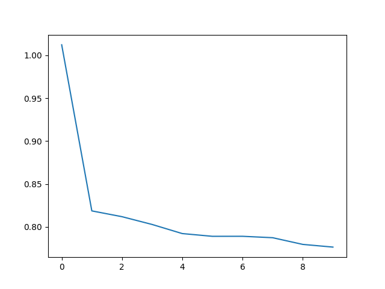
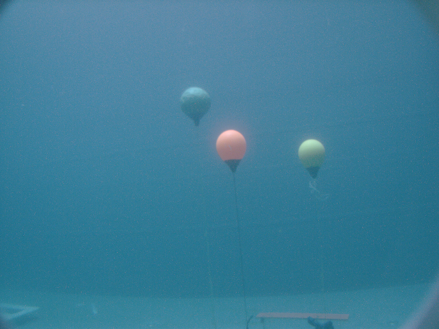
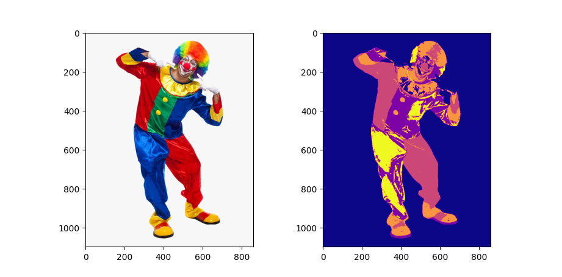

# K-means Clustering and Gaussian Mixture Models
The exercise focuses on assigning categorical values using unsupervised learning. The two methods that we look at are *K-means clustering* and *Gaussian mixture models*. We will implement our own K-means algorithm but use the scikit-learning implementation of Gaussian mixture models.

This will be applied to the Iris database and the results of the clustering is then compared to the target values.

## Section 1 - K-means Clustering
The focus here is to implement the [K-means algorithm](https://en.wikipedia.org/wiki/K-means_clustering) and evaluate it's performance on the Iris dataset. (See Chapter 9.1 in Bishop).

The algorithm aims to split $N$ samples $(x_1, x_2, ... x_N)$ into $K$ clusters where each sample belongs to the cluster which mean is closest to the sample. These means are referred to as *prototypes*  $(\mu_1, \mu_2, ... \mu_K)$

The K-means algorithm has the following steps:
1. Initialize the *K* prototypes. Typically these are chosen at random from the set of samples.
2. *E-step*:
    * Calculate the *distance matrix* ($D$) of size $[N \times K]$. Element $D[i, j]$ is the euclidean distance between sample $i$ and prototype $j$.
    * Determine $r_{nk}$ for each point $x_n$. We set $r_{nk}=1$ and $r_{nj}=0, j\neq k$ if we decide that $x_n$ belongs to $k$. Typically we make this
    determination by choosing the $\mu_k$ closest to $x_n$.
3. We then calculate the value of $J$, our objective function:
    $$J  = \sum_{n=1}^N \sum_{k=1}^K r_{nk} \Vert x_n - \mu_k \Vert^2$$
   our goal is to find values for all $r_{nk}$ and all $\mu_k$ (our parameters) to minimize the value of $J$.
   Here, we will be using the average distance from the points to their cluster means as the objective value (let's call it $\hat{J}$).
   $${\hat{J} = \frac{1}{N}\sum_{n=1}^N \sum_{k=1}^K r_{nk} \Vert x_n - \mu_k \Vert}$$
   
5. *M-step* We now recompute the value of the prototypes:
    $$\mu_k = \frac{\sum_n r_{nk} x_n}{\sum_n r_{nk}}$$
6. Compare the current value of $\hat{J}$ to the previous value of $\hat{J}$. If the difference is above a certain threshold, we perform steps 2-4 again. Otherwise we continue up to a maximum number of iterations.

We will now create the building blocks of the algorithm and then put them together.

### Section 1.1
Create a function `distance_matrix(X, Mu)` which returns the distance matrix detailed above.

Example input and output:
```
a = np.array([
    [1, 0, 0],
    [4, 4, 4],
    [2, 2, 2]])
b = np.array([
    [0, 0, 0],
    [4, 4, 4]])
distance_matrix(a, b)
````
->
```
[[1.         6.40312424]
 [6.92820323 0.        ]
 [3.46410162 3.46410162]]
```

### Section 1.2
Create a function `determine_r(dist)` that determines the indicators $r_{nk}$ as explained above. This function should return an array `r` where `r[i, j] = 1` if sample $x_i$ is closest to prototype $\mu_j$.

Example input and output:
```
dist = np.array([
        [  1,   2,   3],
        [0.3, 0.1, 0.2],
        [  7,  18,   2],
        [  2, 0.5,   7]])
determine_r(dist)
```
->
```
[[1 0 0]
 [0 1 0]
 [0 0 1]
 [0 1 0]]
```

### Section 1.3
Create a function `determine_j(r, dist)` that calculates the value of the objective function, $\hat{J}$, given arrays of indicators and distances.

Example inputs and outputs:
```
dist = np.array([
        [  1,   2,   3],
        [0.3, 0.1, 0.2],
        [  7,  18,   2],
        [  2, 0.5,   7]])
R = determine_r(dist)
determine_j(R, dist)
```
-> `0.9`


### Section 1.4
Create a function `update_Mu(Mu, X, R)` that calculates the new prototypes given the equation in the description.

Example inputs and outputs:
```
X = np.array([
    [0, 1, 0],
    [1, 0, 0],
    [0, 0, 0]])
Mu = np.array([
    [0.0, 0.5, 0.1],
    [0.8, 0.2, 0.3]])
R = np.array([
    [1, 0],
    [0, 1],
    [1, 0]])
update_Mu(Mu, X, R)
```
->
```
[[0.  0.5 0. ]
 [1.  0.  0. ]]
```

### Section 1.5
Now we are ready to combine our units into a single function `k_means(X, k, num_its)`. You will have to add a bit more code to the mix and some of it is supplied to you in the template.

You should run the algorithm `num_its` times. For each iteration we collect the value of the objective function, $\hat{J}$.

`k_means` should return:
* `Mu`: The last values of the prototypes
* `R`: The last value of the indicators
* `Js`: List of $\hat{J}$ values for each iteration of the algorithm.

Example input and output:
```
X, y, c = load_iris()
k_means(X, 4, 10)
```
->
```
array([
    [6.15833333, 2.8875    , 4.82916667, 1.62916667],
    [5.50833333, 2.47083333, 3.82916667, 1.17083333],
    ...),
array([
    [0, 0, 1, 0],
    [0, 0, 1, 0],
    ...),
[0.9844512801797404, 0.7868265220144953, ...]
```

### Section 1.6
Lets take a look at the progression of the objective function as a function of iterations. We hope that the value of the objective function decreases in every iteration. You can use `_plot_j()` for this.

This plot could look something like the following plot



Create this plot and name it as `1_6_1.png` in your PDF.


### Section 1.7
Now create a plot of four experiments for $k \in (2, 3 , 5, 10)$. Plot 4 graphs of $\hat{J}$ as a function of number of iterations onto the sample figure.

This plot should look like the one above, but with for graphs.

Name this plot as `1_7_1.png` in your PDF.

### Section 1.8
*This question should be answered in your PDF*

Answer the following questions:
* According to the results from section 1.7, what is the best value of $k$ according to the objective function?
* If we have $n$ samples and we set $k=n$, what would happen?
* Is it a good strategy to set $k=n$? Why/Why not?

### Section 1.9
The Iris dataset contains flowers of three different types. Can we use `k_means` to cluster together flowers from the same category?

To evaluate this we have to decide which cluster corresponds to which class label. One way of doing this is to:
1. Perform the clustering
2. Using the targets from the iris dataset and the `R` array returned from `k_means`, determine which cluster is most common for each class label.
3. We assign that cluster that class label.

Create a function `k_means_predict(X, t, classes, num_its)` that assigns class labels to clusters like explained above and returns the corresponding class predictions.

Example input and output:
```
X, y, c = load_iris()
k_means_predict(X, y, c, 5)
```
->
```
[0. 0. 0. 0. 0. 0. 0. 0. 0. 0. 0. 0. 0. 0. 0. 0. 0. 0. 0. 0. 0. 0. 0. 0.
 0. 0. 0. 0. 0. 0. 0. 0. 0. 0. 0. 0. 0. 0. 0. 0. 0. 0. 0. 0. 0. 0. 0. 0.
 0. 0. 2. 2. 2. 1. 1. 1. 2. 1. 1. 1. 1. 1. 1. 1. 1. 2. 1. 1. 1. 1. 1. 1.
 ...
 2. 1. 2. 1. 2. 2. 1. 1. 2. 2. 2. 2. 2. 1. 1. 2. 2. 2. 1. 2. 2. 2. 1. 2.
 2. 2. 1. 2. 2. 1.]
```

### Section 1.10
*This question should be answered in your PDF*

Using the actual class labels of the samples and the predictions made by `k_means` determine the accuracy and confusion matrix of the prediction.

You can use `_iris_kmeans_accuracy` for this.


## Section 2 - Clustering an Image
Reykjavik University competed in the [RoboSub competition](http://robosub.org/) in 2010, 2011, 2012 and 2014. The team build an Autonomous Underwater Vehicle (AUV) that was to solve a series of tasks under water without breaching the surface completely autonomously. In the 2011 competition "The Buoy Task" involved navigating the AUV towards coloured buoys and touch them in a given order.



The image given here is taken from a practice run in the Reykjavik University art installation called "Djúpið" (The Deep) where the team had build a practice course. The image is one in a sequence of images taken from the front camera of the vehicle and was intended to guide the vehicle to the correct color buoy.

In this exercise your aim is simply to cluster the image based on its RGB values. In other words, each pixel is represented as a three dimensional vector representing the intensity of red, green and blue colours. These vectors can be treated as any other data vectors and we can apply clustering to these vectors.

We supply you with methods to convert the image to a compatible numpy array and convert a numpy array back to an image.

Normally image data is stored in an object of shape `[width, height, 4]`. Each pixel, i.e. each `image[i, j, :]` value, has 4 attributes:
* intensity of red, green and blue
* the alpha channel which determines the opacity of the pixel. We discard this information here.

The function `tools.image_to_numpy()` returns you a numpy array of shape `[width*height, 3]` where all the pixels have been collapsed into a single column. We don't specifically care about the location of the pixels in this assignment.


### Section 2.1
Try first running your own `k_means` function on the image data with `7` clusters for `5` iterations. You should notice how incredibly slow it is.

Since our implementation is so slow, maybe we should try using an `sklearn` implementation, namely `sklearn.KMeans`.

Finish implementing the function `plot_image_clusters`. In your PDF, show plots for `num_clusters=2, 5, 10, 20`.
Name these plots as `2_1_1.png`-`2_1_4.png`.

Here is an example with 5 clusters, but instead we use a *creepy clown*:



Notice how his creepy hands blend into the background because it is wearing white gloves!
